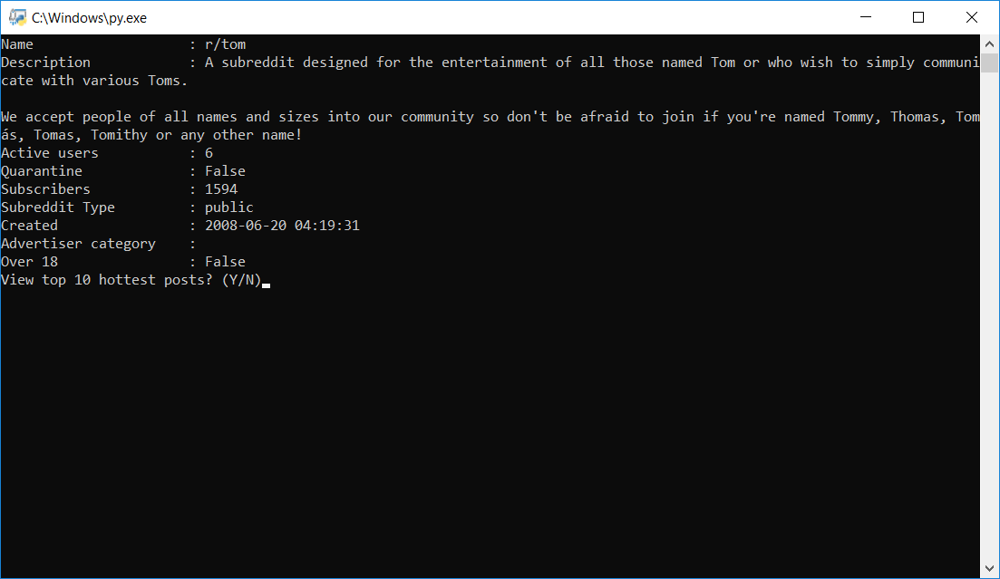
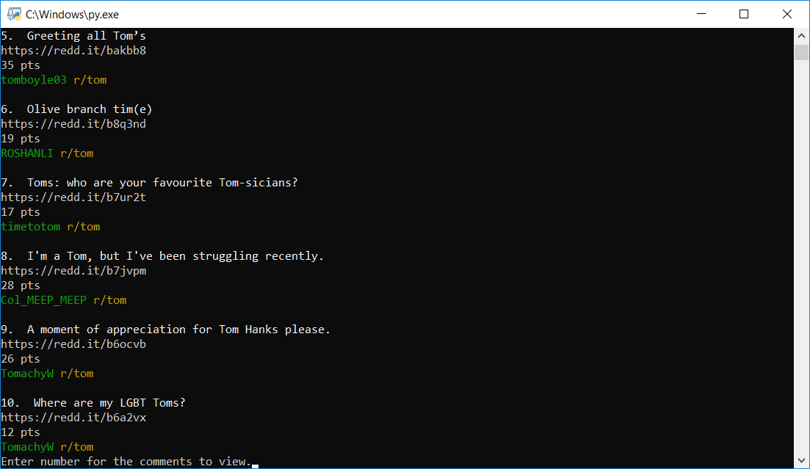

# PythonForReddit

## About
This program allows you to view Reddit with a Python script. I used a Reddit API, SCRAW. Enter your API information in "Credentials.xml".

## Credentials
Please format "Credentials.xml" as the following:

```
<root>
	<client_id></client_id>
	<client_secret></client_secret>
	<username></username>
	<password></password>
	<user_agent></user_agent>
</root>
```

You'll need to create a Reddit account to provide the first four pieces of information.

## Screenshots


